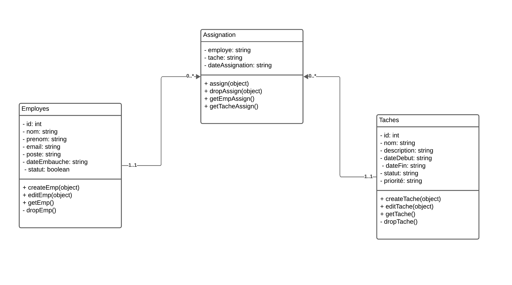

# Survey App

## Description

Modélisation et implémentation en JavaScript un composant métier pour la gestion de projets. Ce composant doit permettre d'effectuer les opérations CRUD(Créer, Lire, Mettre à jour, Supprimer) sur les employes, les taches et les assignations de tache aux employés.

## Prérequis

Pour le prise en main correcte de l'application, il est nécessaire d'avoir installé les éléments suivants :

- [Express js](https://expressjs.com/)
- [Postman](https://www.postman.com/)

## Installation 

Suivez ces étapes pour configurer le projet sur votre machine locale :

1. **Clonez le repository :**

```bash
    git clone https://github.com/shyshasy/gestionProjet.git
```

2. **Accédez au dossier du projet :**

```bash
    cd gestion-commande-express
 ```

3. **Installez les dépendances :**

 ```bash
    npm install express --save
```

```bash
    npm install nodemon
```

```bash
    npm install body-parser
```

## Modelisation



## Fonctionnalités

- Effectuer des opérations CRUD dans index.js
- Lancer postman pour tester l'implementation


## Utilisation

Pour démarrer l'application, exécutez la commande suivante :

```bash
npm start
```
## Auteur

[Aichetou Taher Sy](https://github.com/shyshasy)
# gestionProjet
